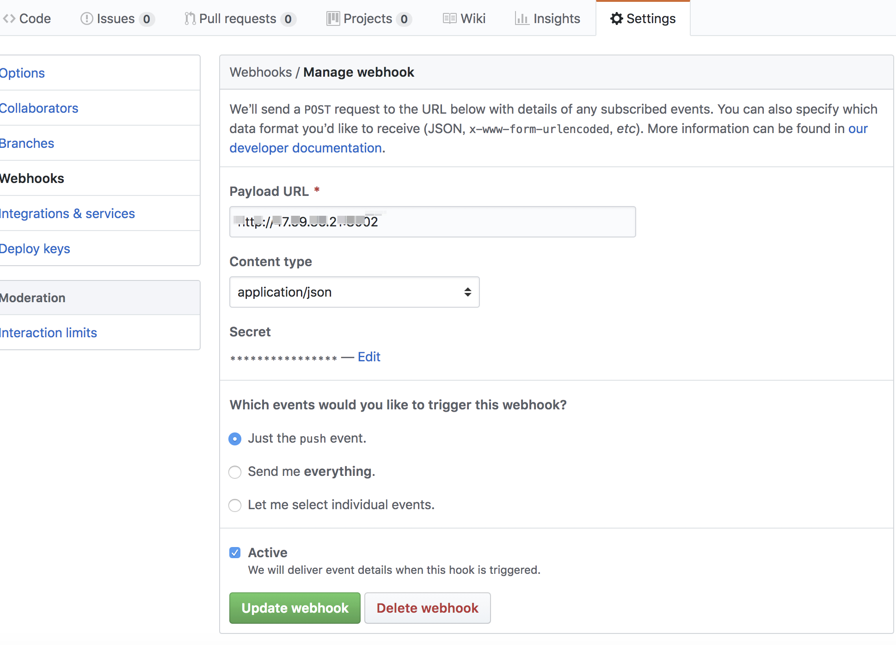

# 使用 `github webhooks` 在 linux 上自动部署项目

### 初衷

每次从本地 push 代码到 github 后，还要在服务器上执行 `git pull`和后续的`npm run build`命令等等,比较麻烦

配置 webhook 后，可以实现本地 push 代码后，由 github 向我们提供的`payload URL` post 请求

### 配置 payload url，secret 可以随便填写，之后会用到

payload url: http://ip:port 启动的服务器地址，也可以是域名形式



我们收到对应请求后可以实现自己的逻辑

linux 服务器上，创建 server 接口服务，可以是任意语言的 server，
我这里 server 服务使用的是[`@octokit/webhooks`](https://www.npmjs.com/package/@octokit/webhooks) 因为比较简单

目录结构

```
├── deploy.sh #收到push时，要执行的自动部署脚本如 git pull
├── node_modules
├── package.json
└── server.js # server
```

server.js

```
const WebhooksApi = require('@octokit/webhooks')
const { spawn } = require('child_process')

const webhooks = new WebhooksApi({
    secret: 'jiangbo' //github webhooks 配置页面设置的secret
})

webhooks.on('*', ({ id, name, payload }) => {
    if (name === 'push') {
        var ls = spawn('sh', ['./deploy.sh'])
        ls.stdout.on('data', (data) => {
            console.log(`输出：${data}`)
        });

        ls.stderr.on('data', (data) => {
            console.log(`错误：${data}`)
        })
    }
})

require('http').createServer(webhooks.middleware).listen(8002)
```

启动该服务

```
node server.js
// 或者使用pm2,防止服务挂掉
pm2 start node server.js
```

正常情况下，你本地 push 代码后，服务器上的服务会收到 push 通知，并执行我们的 deploy.sh 脚本

这里贴一下 deploy.sh

```
#!usr/bin/bash

cd /workspace/gatsby-blog

git pull origin master

pm2 restart blog --update-env

exit 0
```

完整项目地址[`https://github.com/jiangbo2015/webhook`](https://github.com/jiangbo2015/webhook)
