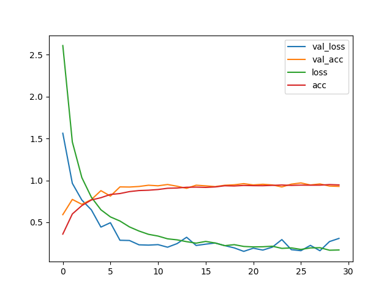
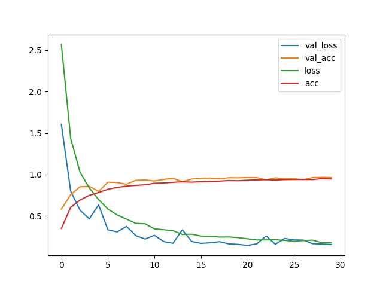

代码结构

```
traffic
-data
  --- train/
  --- test/
-index.py
```

### 主要功能点：数据加载，预处理，图像增强, 预测，数据可视化

不使用 dropout


使用 dropout


```
from keras.preprocessing.image import ImageDataGenerator
from keras.models import Sequential, load_model
from keras.layers.convolutional import Conv2D, MaxPooling2D
from keras.layers.core import Activation, Flatten, Dense, Dropout

from keras import backend as K
from keras.preprocessing.image import img_to_array, load_img
from keras.utils import to_categorical

from imutils import paths
import matplotlib
matplotlib.use('TkAgg')
import matplotlib.pyplot as plt

import numpy as np
import random
import cv2
import os
import sys

```

```
"""
创建模型
"""
def create_model():

    # 根据backend 确定输入
    inputShape = (IMG_SIZE, IMG_SIZE, 3)
    if K.image_data_format() == "channels_first":
        inputShape = (3, IMG_SIZE, IMG_SIZE)

    model = Sequential()

    # 第一层卷集核数量， 卷积核大小，填充方式，输入
    model.add(Conv2D(32, kernel_size=(5, 5), input_shape=inputShape))
    model.add(Activation("relu")) #激活
    model.add(MaxPooling2D(pool_size=(2, 2))) #池化，使用MaxPolling

    model.add(Conv2D(64, kernel_size=(5, 5), activation="relu"))
    model.add(MaxPooling2D(pool_size=(2, 2)))

    model.add(Flatten())

    model.add(Dense(500, activation="relu")) #全链接层

    model.add(Dense(CLASS_NUM, activation="softmax")) #最后输出CLASS_NUM个

    return model

```

完整代码 [github](https://github.com/jiangbo2015/pykit/blob/master/traffic/CT.py)
